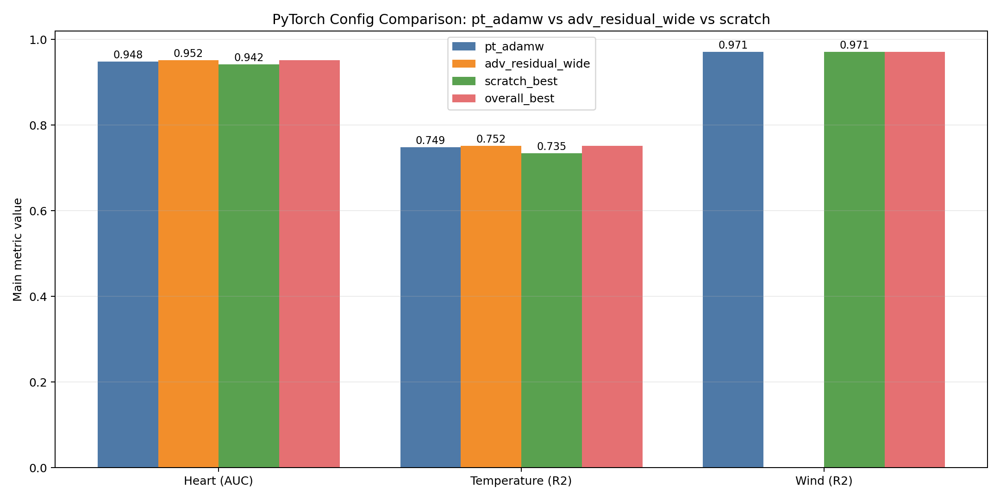
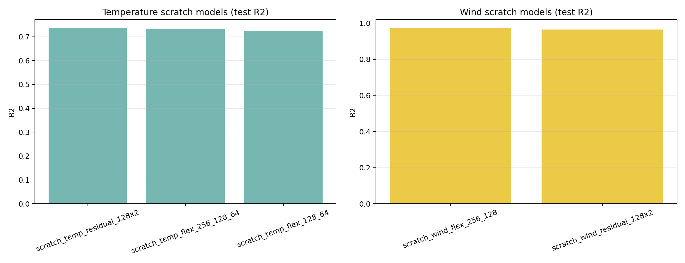

# PyTorch Comparison Report (Show-Ready)

This report compares, for each task:

- First PyTorch DNN config based on AdamW (`pt_adamw`)
- Advanced PyTorch config (`adv_residual_wide`, ResidualMLP) where available
- New primitive-layer "from-scratch" implementation results

Generated files from this update:

- `scratch_layers_temperature_results.csv`
- `scratch_layers_wind_results.csv`
- `scratch_vs_pytorch_comparison.csv`
- `plots/scratch_vs_pytorch_main_metric.png`
- `plots/scratch_other_tasks_detail.png`

## 1) Main comparison (metric-focused)

| Task | Metric | `pt_adamw` | `adv_residual_wide` | Scratch best | Overall best |
|---|---:|---:|---:|---:|---:|
| Heart classification | Test AUC | 0.948484 | 0.951672 | 0.942035 | 0.951672 (`adv_residual_wide`) |
| Temperature regression | Test R² | 0.748625 | 0.752036 | 0.734700 | 0.752036 (`adv_residual_wide`) |
| Wind forecasting | Test R² | 0.970820 | n/a | 0.970979 | 0.971016 (`pt_scheduler_cosine`) |

Note for wind: `adv_residual_wide` was part of advanced heart/temperature runs and was not run in the original wind advanced pipeline.

## 2) Parameters and results to present directly

### Heart classification

- `pt_adamw` (from `heart_pytorch_results.csv`)
	- Architecture: FlexMLP hidden=[256,128]
	- Optimizer: AdamW
	- Weight decay: 0.01
	- Dropout: 0.0
	- BatchNorm: False
	- Scheduler: none
	- Base LR: 0.01
	- Epochs: 39
	- Test AUC: 0.948484

- `adv_residual_wide` (from `heart_advanced_results.csv`)
	- Architecture: ResidualMLP hidden_dim=512, n_blocks=4
	- Loss: BCELoss (default)
	- Optimizer: AdamW
	- Weight decay: 0.01
	- Scheduler: none
	- Dropout: 0.0
	- Base LR: 0.01
	- Epochs: 49
	- Test AUC: 0.951672

- Scratch best (from `scratch_layers_heart_results.csv`)
	- Config: `scratch_flex_small`
	- Architecture: ScratchFlexMLP hidden=[64,32], dropout=0.1
	- Primitive layers used: `MyLinear`, `MyBatchNorm1d`
	- Optimizer: AdamW
	- LR / WD / Batch size: 0.01 / 0.001 / 32
	- Epochs run: 35
	- Test AUC: 0.942035

### Temperature regression

- `pt_adamw` (from `temperature_pytorch_results.csv`)
	- Architecture: FlexMLP hidden=[256,128,64]
	- Optimizer: AdamW
	- Weight decay: 0.01
	- Dropout: 0.0
	- BatchNorm: False
	- Scheduler: none
	- Base LR: 0.001
	- Epochs: 77
	- Test R²: 0.748625

- `adv_residual_wide` (from `temperature_advanced_results.csv`)
	- Architecture: ResidualMLP hidden_dim=512, n_blocks=4
	- Loss: MSELoss (default)
	- Optimizer: AdamW
	- Weight decay: 0.01
	- Scheduler: none
	- Dropout: 0.0
	- Base LR: 0.001
	- Epochs: 54
	- Test R²: 0.752036

- Scratch best (from `scratch_layers_temperature_results.csv`)
	- Config: `scratch_temp_residual_128x2`
	- Architecture: ScratchResidualMLP hidden=128, blocks=2, dropout=0.1
	- Primitive layers used: `MyLinear`, `MyBatchNorm1d`
	- Optimizer: AdamW
	- LR / WD / Batch size: 0.001 / 0.001 / 256
	- Epochs run: 62
	- Test R²: 0.734700

### Wind forecasting

- `pt_adamw` (from `wind_pytorch_results.csv`)
	- Architecture: FlexMLP hidden=[256,128]
	- Optimizer: AdamW
	- Weight decay: 0.01
	- Dropout: 0.0
	- BatchNorm: False
	- Scheduler: none
	- Base LR: 0.01
	- Epochs: 34
	- Test R²: 0.970820

- Advanced baseline reference (best standard config)
	- Config: `pt_scheduler_cosine`
	- Architecture: FlexMLP hidden=[256,128]
	- Optimizer: Adam + CosineAnnealingLR
	- Test R²: 0.971016

- Scratch best (from `scratch_layers_wind_results.csv`)
	- Config: `scratch_wind_flex_256_128`
	- Architecture: ScratchFlexMLP hidden=[256,128]
	- Primitive layers used: `MyLinear`, `MyBatchNorm1d`
	- Optimizer: AdamW
	- LR / WD / Batch size: 0.01 / 0.0001 / 512
	- Epochs run: 26
	- Test R²: 0.970979

## 3) Plots (for direct presentation)

### Main comparison plot

### Scratch runs for the two new tasks

## 4) One-line conclusion for consultation

We now show both: (1) classical PyTorch architecture-level implementation (`pt_adamw`, `ResidualMLP`) and (2) primitive layer-level implementation (`MyLinear`, `MyBatchNorm1d`) with runnable results on all three tasks; best overall remains `adv_residual_wide` for heart/temperature and `pt_scheduler_cosine` for wind.
